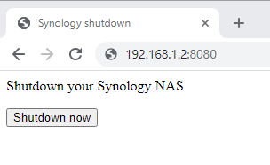

# Synology NAS DiskStation Webserver Shutdown

A simple python app which lets you shutdown your Synology DiskStation NAS via the Web Browser to save energy consumption.

## Usage

1. Install Python3 from the DiskStation package manager
1. Transfer the `webserver_shutdown.py` and `webserver_shutdown.conf` file from your PC via scp to your NAS 
   `scp webserver_shutdown* youruser@192.168.1.2:/tmp`
2. Login via SSH (e.g. [Putty](https://www.chiark.greenend.org.uk/~sgtatham/putty/latest.html)) on your Synology NAS
3. Move the uploaded files to its destination 
   `sudo mv /tmp/webserver_shutdown.py /usr/` 
   `sudo mv /tmp/webserver_shutdown.conf /etc/init/`
4. Reboot the DiskStation
   `sudo reboot`
5. Access the webpage via (replace the IP 192.168.1.2 with that IP of your DiskStation) 
   `http://192.168.1.2:8080`

   
